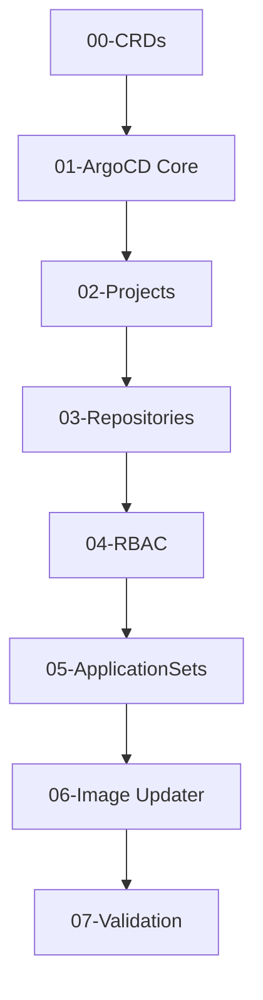
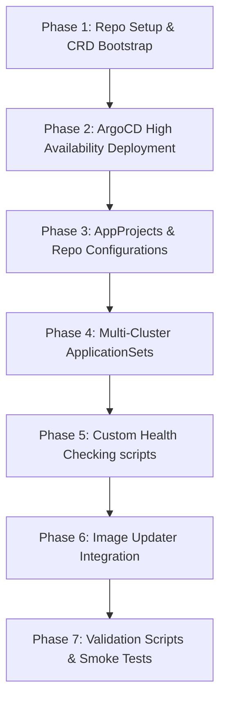

# Goal Description

This document defines the GitOps deployment architecture, App of Apps hierarchies, ApplicationSet policies, environment promotion strategies, and bootstrap roadmap for the `platform-gitops` repository (located in the workspace under [sws-gitops](file:///Users/poom-ytthpch/Documents/sws/sws-infra/sws-gitops)).

This repository functions as the **GitOps Orchestration and Deployment Control Plane (Layer 4)**. It deploys ArgoCD, registers cluster credentials, configures AppProject boundaries, exposes multi-environment ApplicationSets, automates image promotion policies (`ArgoCD Image Updater`), and handles Git-driven rollbacks and self-healing.

It coordinates the deployment lifecycle of the cluster foundation (`platform-core`), middlewares (`platform-services`), observability stacks (`platform-observability`), and security engines (`platform-security`) across dev, staging, and production clusters without manual commands.

---

## User Review Required

> [!IMPORTANT]
> **1. GitOps Engine: ArgoCD vs. FluxCD**
> - *Recommendation*: Standardize on **ArgoCD** for enterprise deployments. ArgoCD provides a rich visual UI, native ApplicationSets supporting Matrix Generators, a declarative App of Apps pattern, and built-in SSO/OIDC auth mappings. FluxCD is lightweight but lacks native dashboard-level cluster RBAC controls and centralized tenant management.
>
> **2. ArgoCD Dex vs. Direct OIDC integration**
> - *Proposal*: Disable Dex and integrate ArgoCD directly with the enterprise Identity Provider (e.g. Okta or Keycloak) via OpenID Connect (OIDC) protocols. This simplifies the login topology and removes Dex broker overhead.
>
> **3. Deployment Promotion Model**
> - *Proposal*: Use **Image Tag Promotion** managed via pull requests in Git. Dev environments sync automatically using the `:latest-dev` prefix tags (monitored by ArgoCD Image Updater), while staging and production environments require a commit pinned to specific SemVer tags (e.g. `v1.2.3`) promoted via Git PR workflows.

---

## Open Questions

> [!WARNING]
> **1. How many physical clusters will be registered initially?**
> - *Context*: ArgoCD requires network access to target API servers. We propose a Hub-and-Spoke topology where the ArgoCD instance on the management cluster deploys manifests to development, staging, and production workload spoke clusters.
>
> **2. Should automatic drift pruning (Self-Heal) be enabled on production databases?**
> - *Context*: We recommend turning on `selfHeal: false` for production database deployments (PostgreSQL, MariaDB) to prevent unintentional data drops if DB structures are modified out-of-band during an incident. Workloads like Stateless APIs should have `selfHeal: true` enabled.

---

## Proposed Changes

### 1. Overall GitOps Platform Integration

The declarative deployment flow is governed entirely via Git repository states:

```
  Developer Action          CI/CD Automation             ArgoCD Controller (GitOps Hub)
┌─────────────────┐       ┌─────────────────┐       ┌─────────────────────────────────────┐
│   Push Code /   ├──────►│   Build Image   ├──────►│  Watches Git (sws-gitops)           │
│   Update Tag    │       │   (Push to Registry) │   │  - Matches App of Apps state        │
└─────────────────┘       └─────────────────┘       │  - Auto-heals manual cluster drifts │
                                                    └──────────────────┬──────────────────┘
                                                                       │ Deploys resources
                                                                       ▼
                                                    ┌─────────────────────────────────────┐
                                                    │        Workload Clusters            │
                                                    │      (Dev, Staging, Prod)           │
                                                    └─────────────────────────────────────┘
```

---

### 2. Repository Directory Structure

The `platform-gitops` repository (under [sws-gitops](file:///Users/poom-ytthpch/Documents/sws/sws-infra/sws-gitops)) will be structured as follows:

```
sws-gitops/
├── bootstrap/                    # Direct cluster bootstrap files
│   └── root-app.yaml             # Root ArgoCD App of Apps file pointing to control-plane
├── helmfile.yaml                 # Root Helmfile bootstrapping ArgoCD stack
├── helmfile.d/                   # Separated, ordered Helmfiles
│   ├── 00-crds.yaml              # ArgoCD Custom Resource Definitions
│   ├── 01-argocd.yaml            # ArgoCD core deployment (HA settings)
│   ├── 02-projects.yaml          # AppProjects defining team tenant boundaries
│   ├── 03-repositories.yaml      # Cluster credential associations
│   ├── 04-rbac.yaml              # SSO role mapping and access policy
│   ├── 05-applicationsets.yaml   # Multi-environment cluster AppSets
│   ├── 06-image-updater.yaml     # ArgoCD Image Updater
│   └── 07-validation.yaml        # Validation checkpoints
├── environments/                 # Configurations values per target cluster
│   ├── default/                  # Shared base values
│   │   └── argocd-values.yaml
│   ├── development/              # Dev values (Auto-sync, self-heal, loose rules)
│   ├── staging/                  # Staging values (Auto-sync, stricter rules)
│   └── production/               # Production values (Manual sync approval, strict freeze)
├── projects/                     # Declarative ArgoCD AppProject resources
│   ├── core-project.yaml
│   └── app-project.yaml
├── applicationsets/              # ApplicationSet templates mapping to cluster selectors
│   ├── platform-apps.yaml
│   └── business-apps.yaml
├── health/                       # Custom Lua status checkers for CRDs
│   └── kafka-health.lua
├── validation/                   # Cluster state health checking scripts
│   ├── check-*.sh
│   └── run-all.sh
├── .github/                      # CI/CD pipelines
│   └── workflows/
│       └── lint-validate.yaml    # CI checks (kubeconform on AppSets, yaml lints)
├── Makefile                      # Targets for operations automation
└── README.md                     # Documentation entrypoint
```

---

### 3. Bootstrap Layers & Dependency Graph



---

### 4. App of Apps & ApplicationSet Design

We implement the **Matrix Generator** inside ApplicationSets to dynamically combine clusters with application configurations:

```yaml
# Sample ApplicationSet: Deploy business microservices over target clusters
apiVersion: argoproj.io/v1alpha1
kind: ApplicationSet
metadata:
  name: business-microservices
  namespace: argocd
spec:
  generators:
    - matrix:
        generators:
          # Spoke Clusters Discovery
          - clusters:
              selector:
                matchLabels:
                  environment: production
          # Applications Discovery
          - git:
              repoURL: https://github.com/sws/sws-gitops.git
              revision: HEAD
              directories:
                - path: apps/*
  template:
    metadata:
      name: '{{path.basename}}-{{name}}'
    spec:
      project: default
      source:
        repoURL: https://github.com/sws/sws-gitops.git
        targetRevision: HEAD
        path: '{{path}}'
      destination:
        server: '{{server}}'
        namespace: '{{path.basename}}'
      syncPolicy:
        automated:
          prune: true
          selfHeal: true
```

---

### 5. Multi-Environment & Multi-Cluster Promotion Architecture

Workloads promote sequentially across stages:

```
  Development Cluster             Staging Cluster                Production Cluster
┌─────────────────────┐       ┌─────────────────────┐       ┌─────────────────────┐
│  Tag: :latest-dev   │       │  Tag: v1.2.x-rc     │       │  Tag: v1.2.3 (SemVer│
│  Auto-Sync: True    ├──────►│  Auto-Sync: True    ├──────►│  Auto-Sync: False   │
│  Self-Heal: True    │       │  Self-Heal: True    │       │  Self-Heal: False   │
└─────────────────────┘       └─────────────────────┘       └─────────────────────┘
```

---

### 6. Custom Health Checks (Kafka, Redis, Postgres Lua checkers)

We deploy custom Lua scripts to allow ArgoCD to determine the real-time health of database resources. For example, checking if Kafka has fully synchronized partitions:

```lua
hs = {}
if obj.status ~= nil then
  if obj.status.conditions ~= nil then
    for i, condition in ipairs(obj.status.conditions) do
      if condition.type == "Ready" and condition.status == "True" then
        hs.status = "Healthy"
        hs.message = "Kafka cluster is ready and in sync"
        return hs
      end
    end
  end
end
hs.status = "Progressing"
hs.message = "Waiting for all cluster brokers to reporting synchronization"
return hs
```

---

### 7. Version Management (Compatibility Matrix)

Standardized chart and container versions pinned for GitOps control layers:

| Component | Helm Chart Reference | Version | Container Image | Target Kubernetes |
| :--- | :--- | :--- | :--- | :--- |
| **ArgoCD** | `argo/argo-cd` | `5.36.0` | `argocd:v2.8.2` | `>= 1.25.0` |
| **ArgoCD Image Updater** | `argo/argocd-image-updater` | `0.9.1` | `argocd-image-updater:v0.12.1` | `>= 1.25.0` |

---

### 8. Implementation Roadmap



#### Phase 1: Repo Setup & CRD Bootstrap
- **Objectives**: Initialize directories, Makefiles, and OTel CRD definitions.
- **Deliverables**: `.github/workflows/lint-validate.yaml`, `Makefile`, `helmfile.d/00-crds.yaml`.
- **Acceptance Criteria**: Running `make lint` returns code 0.

#### Phase 2: ArgoCD High Availability Deployment
- **Objectives**: Deploy HA controllers and Redis.
- **Deliverables**: `helmfile.d/01-argocd.yaml`, HA configuration values.
- **Acceptance Criteria**: ArgoCD server pods scale successfully on the control plane.

#### Phase 3: AppProjects & Repo Configurations
- **Objectives**: Set up projects and register repositories.
- **Deliverables**: `helmfile.d/02-projects.yaml`, `helmfile.d/03-repositories.yaml`.
- **Acceptance Criteria**: Repositories status shows `Successful` connection inside ArgoCD console.

#### Phase 4: Multi-Cluster ApplicationSets
- **Objectives**: Configure Matrix/Git generator AppSets.
- **Deliverables**: `helmfile.d/05-applicationsets.yaml`, ApplicationSet manifests.
- **Acceptance Criteria**: ArgoCD controller instantiates child applications automatically.

#### Phase 5: Custom Health Checking scripts
- **Objectives**: Inject Lua checkers.
- **Deliverables**: `health/kafka-health.lua`, `health/postgres-health.lua`.
- **Acceptance Criteria**: Database state changes reflect as `Healthy` or `Progressing` in ArgoCD.

#### Phase 6: Image Updater Integration
- **Objectives**: Automate tag promotion.
- **Deliverables**: `helmfile.d/06-image-updater.yaml`.
- **Acceptance Criteria**: Image updater monitors registry and updates deployment tags.

#### Phase 7: Validation Scripts & Smoke Tests
- **Objectives**: Run checking tools.
- **Deliverables**: `validation/run-all.sh`, `validation/check-*.sh`.
- **Acceptance Criteria**: Validation checks complete with exit code 0.

---

## Verification Plan

### Automated Tests
Run static check commands in GitHub Actions workflow:
```bash
helmfile -e production template
```

### Manual Verification
1. Run `make install ENV=development` to deploy to a test cluster.
2. Verify that the ArgoCD login UI console is accessible.
3. Commit a small change to a dummy application manifest in the repository and verify that ArgoCD auto-syncs the changes to target nodes.
